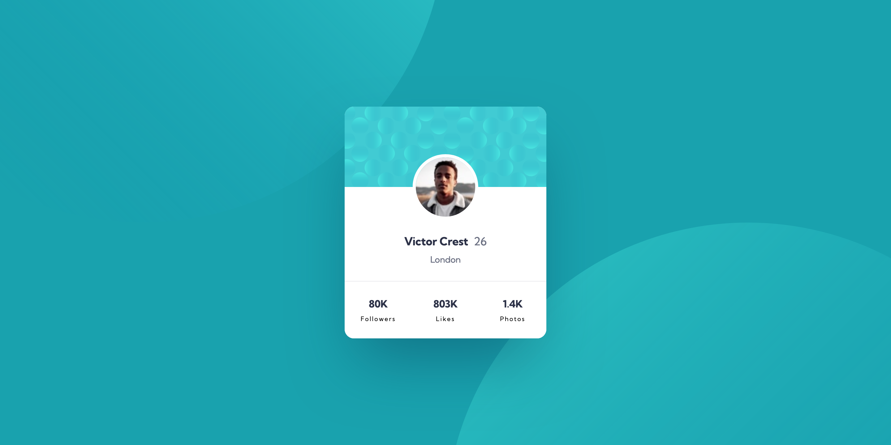

# Frontend Mentor - Stats preview card component solution

This is a solution to the [Profile card component challenge on Frontend Mentor](https://www.frontendmentor.io/challenges/profile-card-component-cfArpWshJ). Frontend Mentor challenges help you improve your coding skills by building realistic projects.

## Table of contents

- [Overview](#overview)
  - [The challenge](#the-challenge)
  - [Self assigned challenges](#self-assigned-challenges)
  - [Screenshot](#screenshot)
  - [Links](#links)
- [My process](#my-process)
  - [Built with](#built-with)
  - [What I learned](#what-i-learned)
  - [Continued development](#continued-development)
  - [Useful resources](#useful-resources)
- [Author](#author)
- [Acknowledgments](#acknowledgments)

## Overview

### The challenge

Users should be able to:

- View the optimal layout depending on their device's screen size

### Self assigned challenges

- Use BEM to organise CSS.
- Think a bit more about what elements to use for the design (e.g. if something seems like it would be clickable but wouldn't take the user to a different page, it should be a button rather than a link.)

### Screenshot

### Links

- [Solution URL](https://www.frontendmentor.io/solutions/profile-card-component-TLIvKinbo8)
- [Live Site URL](https://sh-profile-card-component.netlify.app/)

## My process

### Built with

- Semantic HTML5 markup
- CSS custom properties
- Flexbox
- CSS Grid

### What I learned

- Using `transform` on an element means that any border you apply gets funky. Instead, you can use outline to get around this. Wasn't necessary in the end, decided to use margin in the end instead.

- Sometimes, chasing pixel perfection isn't necessarily the right path. I tried for so long to make the background work exactly per the design, but in the end it just felt so hacky and convoluted that it felt like what I coded was much cleaner, yet still achieved the same visual impact.

### Continued development

- Be mindful of the line between "pixel perfection" and "close enough". If you can capture the essence and feel of what the designer has asked for, but there's one thing that is out which would require tremendous effort for little impact on UI/UX, then that would be a time to cut your cloth accordingly.

### Useful resources

- [Chasing the Pixel-Perfect Dream](https://www.joshwcomeau.com/css/pixel-perfection/) - I was unsure of whether in the real world, designers would expect an exact replica of their design. This article gave me the confidence to say "hey, this is close enough".

## Author

- Website - [Sam Hemingway](https://samhemingway.dev)
- Frontend Mentor - [@SamHemingway](https://www.frontendmentor.io/profile/samhemingway)

### Acknowledgements

- Big thank you again to Grace on the FEM Slack channel who offered me advice (and shared the above article with me) on chasing pixel perfection when I was trying to find a way to achieve it.
